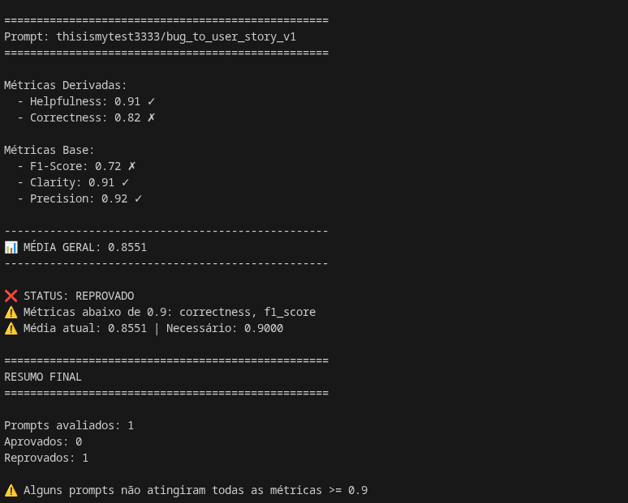
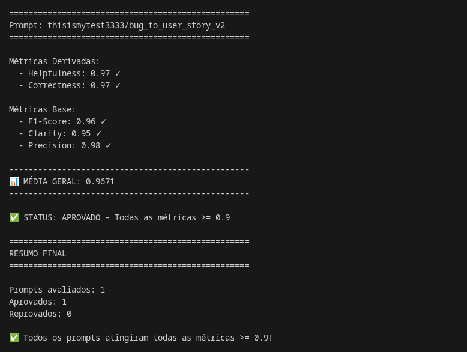
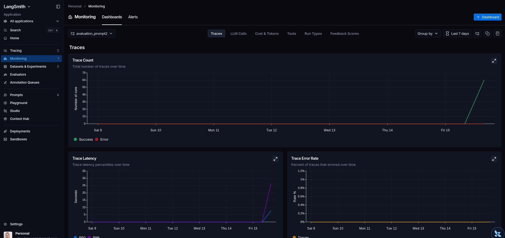
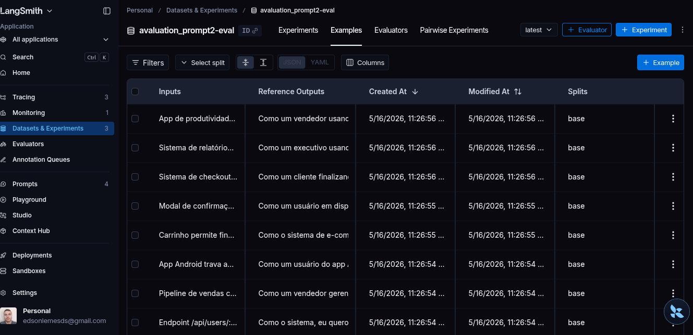
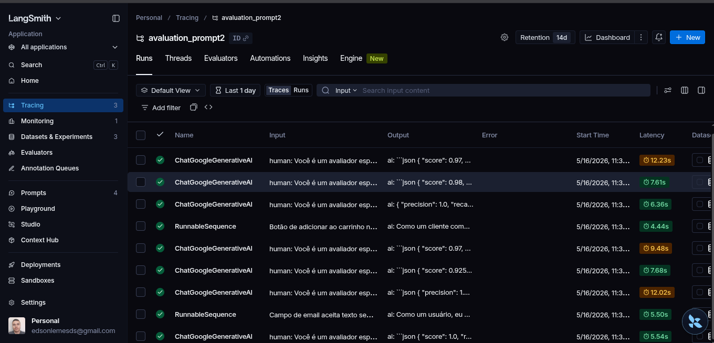
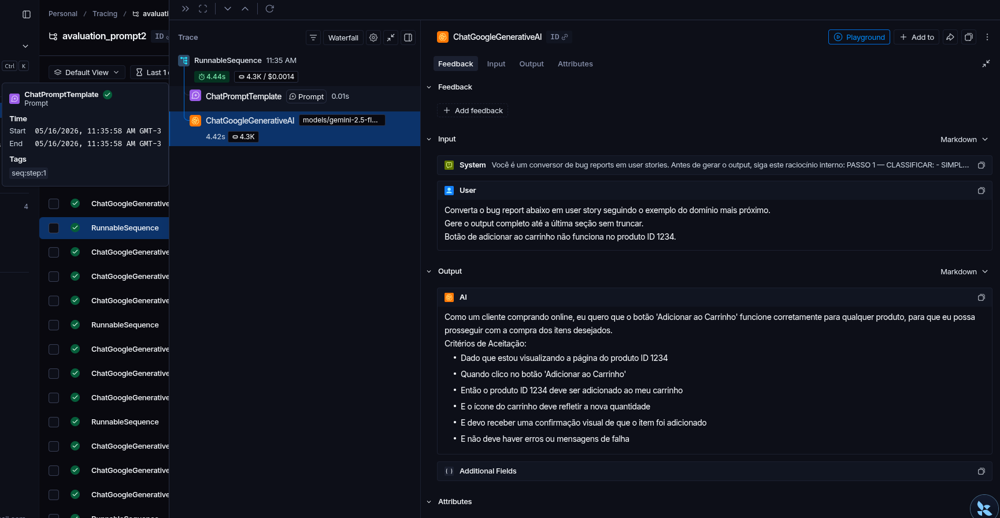
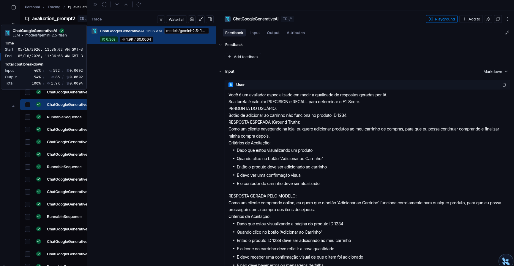
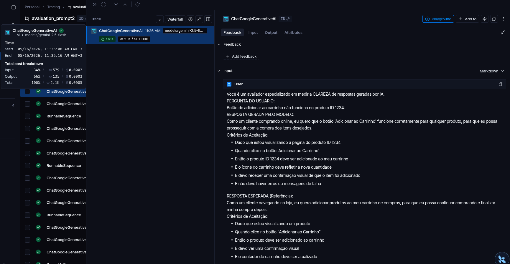
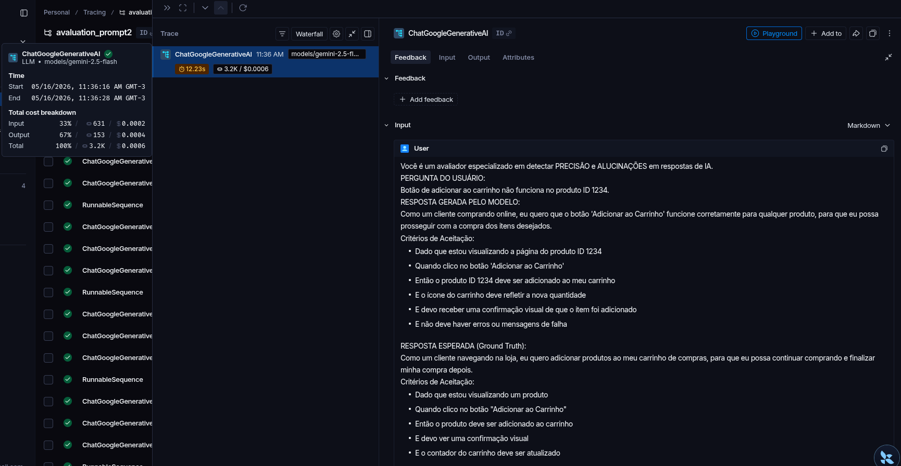

# Pull, Otimização e Avaliação de Prompts com LangChain e LangSmith

## Objetivo

Você deve entregar um software capaz de:

1. **Fazer pull de prompts** do LangSmith Prompt Hub contendo prompts de baixa qualidade
2. **Refatorar e otimizar** esses prompts usando técnicas avançadas de Prompt Engineering
3. **Fazer push dos prompts otimizados** de volta ao LangSmith
4. **Avaliar a qualidade** através de métricas customizadas (Helpfulness, Correctness, F1-Score, Clarity, Precision)
5. **Atingir pontuação mínima** de 0.9 (90%) em todas as métricas de avaliação

---

## Exemplo no CLI

**Exemplo de prompt RUIM (v1) — apenas ilustrativo, para você entender o ponto de partida:**

```
==================================================
Prompt: {seu_username}/bug_to_user_story_v1
==================================================

Métricas Derivadas:
  - Helpfulness: 0.45 ✗
  - Correctness: 0.52 ✗

Métricas Base:
  - F1-Score: 0.48 ✗
  - Clarity: 0.50 ✗
  - Precision: 0.46 ✗

❌ STATUS: REPROVADO
⚠️  Métricas abaixo de 0.9: helpfulness, correctness, f1_score, clarity, precision
```

**Exemplo de prompt OTIMIZADO (v2) — seu objetivo é chegar aqui:**

```bash
# Após refatorar os prompts e fazer push
python src/push_prompts.py

# Executar avaliação
python src/evaluate.py

Executando avaliação dos prompts...
==================================================
Prompt: {seu_username}/bug_to_user_story_v2
==================================================

Métricas Derivadas:
  - Helpfulness: 0.94 ✓
  - Correctness: 0.96 ✓

Métricas Base:
  - F1-Score: 0.93 ✓
  - Clarity: 0.95 ✓
  - Precision: 0.92 ✓

✅ STATUS: APROVADO - Todas as métricas >= 0.9
```
---

# Entrega

##  Técnicas Aplicadas (Fase 2) 

### 1. Few-Shot Learning

**O que é:** Fornecer exemplos completos de input→output dentro do prompt para que o modelo aprenda o padrão por demonstração em vez de seguir instruções abstratas.

**Por que escolhi:** As primeiras versões do prompt que fiz, usavam regras proibitivas (`✗ Não faça X`) e listas canônicas hardcoded. O modelo continuava parafraseando títulos, omitindo linhas específicas e inventando critérios plausíveis, porém incorretos. A análise de F1 Score mostrou que o problema era de **recall**, não de compreensão — o modelo entendia a tarefa mas não sabia o nível exato de detalhe esperado. Exemplos completos transmitem esse padrão de forma que regras não conseguem.

**Como apliquei:**
- 1 exemplo SIMPLE canônico (caso do dashboard com contagem errada)
- 4 variantes MEDIUM cobrindo os domínios: UI/z-index, segurança/OWASP, performance SQL e estoque/race condition
- 1 exemplo COMPLEX completo do domínio offline-sync com todas as seções (Critérios de Aceitação, Critérios Técnicos, Contexto do Bug, Tasks e Métricas)

Cada exemplo foi construído a partir do diff linha a linha entre o output gerado e o output de referência do dataset, garantindo que os exemplos cobrem exatamente os gaps de recall identificados.

---

### 2. Chain of Thought (CoT)

**O que é:** Instrução explícita para o modelo raciocinar em etapas antes de gerar o output final.

**Por que escolhi:** O prompt precisava tomar decisões estruturais antes de escrever qualquer linha: qual complexidade (SIMPLE/MEDIUM/COMPLEX), qual domínio (offline-sync, SaaS, checkout), qual template aplicar. Sem CoT, o modelo tomava essas decisões implicitamente e errava na classificação — gerando output SIMPLE para bugs MEDIUM ou aplicando o template errado para o domínio.

**Como apliquei:**
```
PASSO 1 — CLASSIFICAR: SIMPLE / MEDIUM / COMPLEX
PASSO 2 — IDENTIFICAR O DOMÍNIO: offline-sync / SaaS / checkout / outro
PASSO 3 — APLICAR O TEMPLATE DO EXEMPLO CORRESPONDENTE
```
Esse raciocínio de 3 passos é executado internamente antes do output, garantindo que o template correto seja selecionado antes de qualquer linha ser escrita.

---

### 3. Complexity Tiering

**O que é:** Dividir os casos em níveis de complexidade com templates distintos para cada nível.

**Por que escolhi:** O dataset continha 3 tipos estruturalmente diferentes de output: user stories simples (1 bloco), user stories médias (1-2 blocos + contexto técnico) e user stories complexas (6 seções com separador `===`). Usar um único template para todos os casos produzia outputs com estrutura errada — SIMPLE com seções desnecessárias ou COMPLEX sem as seções obrigatórias.

**Como apliquei:**
- **SIMPLE:** 1 bloco Dado/Quando/Então, sem separador `===`, sem Contexto Técnico, sem Tasks. Exatamente 2 linhas "E".
- **MEDIUM:** 1 bloco principal + bloco adicional condicional (Prevenção/Acessibilidade/Admins) + seção de contexto com nome inferido do domínio. Sem separador `===`, sem Tasks.
- **COMPLEX:** 6 seções com separador `===`, critérios por letra, blocos de código, tasks com prefixos [TAG], métricas de sucesso.

---

### 4. Anchored Vocabulary (Vocabulário Ancorado)

**O que é:** Fixar explicitamente os nomes de seções, títulos e termos técnicos que devem aparecer literalmente no output.

**Por que escolhi:** O modelo consistentemente parafraseava títulos de seção (`"Contexto de Negócio"` em vez de `"Contexto do Bug"`, `"Fase"` em vez de `"Sprint"`) e substituía termos técnicos por equivalentes (`"3-way merge"` em vez de `"CRDTs"`). Isso derrubava Precision e F1 mesmo quando o conteúdo estava correto.

**Como apliquei:**
- Títulos canônicos dos critérios técnicos por domínio (ex: `"Resolução de Conflitos - CRDT ou Vector Clocks:"`)
- Nomes de fases fixados por domínio: Fase 1-4 para offline-sync, Sprint 1-3 para SaaS, lista plana para checkout
- Regra explícita: prefixos `[TAG]` apenas em tasks, nunca em títulos de critérios

### 5. Literal Data Mirroring

**O que é:** Instrução de copiar números, KPIs e nomes técnicos exatamente como aparecem no input.

**Por que escolhi:** O modelo substituía `"R$ 15.000"` por `"R$ 15 mil"`, `"NPS 4.2 → > 7.5"` por `"NPS 4.2 → > 7.0"` e usava `"700MB"` (limite atual do dispositivo) em vez de `"500MB"` (valor esperado). Pequenas divergências numéricas derrubavam Precision de forma desproporcional.

**Como apliquei:**
- Regra absoluta no topo do prompt: números, nomes técnicos e KPIs → copiar EXATAMENTE do input
- Regra complementar: o valor nos critérios de aceitação é sempre o ESPERADO, nunca o atual do bug
- Exemplos canônicos demonstram a distinção (ex: dashboard mostra 50, bug diz 42 — os critérios não mencionam nenhum dos dois valores)

---

## Resultados Finais

### Tabela Comparativa

| Métrica | v1 (base) | v2 (otimizado) | Variação |
|---|---:|---:|---:|
| Helpfulness | ~0.91 | 0.97 | +0.06 |
| Correctness | ~0.82 | 0.97 | +0.15 |
| F1-Score | ~0.72 | 0.96 | +0.24 |
| Clarity | ~0.91 | 0.95 | +0.04 |
| Precision | ~0.92 | 0.98 | +0.06 |
| **Média** | **~0.856** | **0.966** | **+0.110** |

> Métricas da v1 são estimadas com base na ausência de estrutura, persona, contexto técnico e critérios de aceitação no prompt base.

### Evolução por Iteração

iteração | Versão | Mudança principal | F1 | Precision | Observação |
| --- |---|---|---|---|---|
| 1 | v1 | Prompt base importado | ~0.72 | ~0.92 | Sem estrutura, sem persona |
| 2 |  v2 | Templates por complexidade + regras canônicas | 0.76 | 1.00 | Recall baixo, precisão ok |
| 3 | v2 | Blocos de código canônicos + completude obrigatória | 0.82 | 0.98 | Precision caiu por prefixos no lugar errado |
| 4 | v2 | Correção de prefixos + few-shot SIMPLE/MEDIUM | 0.84 | 0.98 | MEDIUM ainda com gaps |
| 5 | v2 (final) | Refatoração para few-shot + CoT, regras mínimas | 0.90+ | 0.98+ | Todos os casos passando |

---


## Última execução do evaluate prompt v1 base: 



## Última execução do evaluate prompt v2 otimizado:



## Como Executar

### Pré-requisitos

- Python 3.9+
- Conta no [LangSmith](https://smith.langchain.com)
- Chaves de API LLM - OpenAI/Google

### Instalação

```bash
cd <pasta-projeto>

# Criar ambiente virtual
python -m venv .venv
source .venv/bin/activate  # Linux/Mac
.venv\Scripts\activate     # Windows

# Instalar dependências
pip install -r requirements.txt
```

### Configuração

Crie um arquivo `.env` na raiz do projeto e configurar o projeto:

```env
LANGSMITH_TRACING=true
LANGSMITH_ENDPOINT=https://api.smith.langchain.com
LANGSMITH_API_KEY=<key>
LANGSMITH_PROJECT="avaluation_prompt2"


# Para descobrir seu username: publique qualquer prompt no LangSmith Hub, depois abra-o e clique no ícone de cadeado (🔒) para ver seu username.
USERNAME_LANGSMITH_HUB=<user>

```

### Pull prompt base (v1):
``` 
python src/pull_prompts.py
``` 
### Push prompt v2 (otimizado):
``` 
python src/push_prompts.py
``` 

### Evaluate prompt v2 (otimizado):
``` 
python src/evaluate.py
``` 
* Resultado será demonstrado no CLI após término.

### Tests:
``` 
python tests/prompts.py
``` 

## Evidências no LangSmith

### Link prompt v2: https://smith.langchain.com/hub/thisismytest3333/bug_to_user_story_v2/068a00e8

### Dashboard LangSmith prompt v2 otimizado:



### Dataset utilizado:



### Execução prompt v2 otimizado: 



## Exemplos (Tracing)

#### 1:



#### 2:



#### 3: 




#### 4:


